# This is Virtual Queue Management Application in which a person can create a ticket without physically present at the location

## The purpose of making this application is 

- To save time so that we don't need to stant in the queue for long time
- Effective use of time as person can be present in more than one queue at a time by not even physically present at any location
- It can be used to reduce unnecessary crowd so that people can maintain social distancing effectively

## FEATURES

- There are two different dashboards for regukar users and store owners(admin)
- A user can create tickets for more then 1 store at a time
- Can get update of current active number in queue and total numbers in queue
- User info will be saved in cookie for 90 days hence no need to login again when refresh

## Tools And Technology used-

- React.js for frontend
- Material-UI
- node.js/ExpressJs API for backend [Api source code](https://github.com/atisheyJain03/inqueue_backend)
- socket.io for realtime functionality
- Mongodb with mongoose for database
- jwt
- HTML,CSS,javascript
- Hosted on firebase

### HomePage

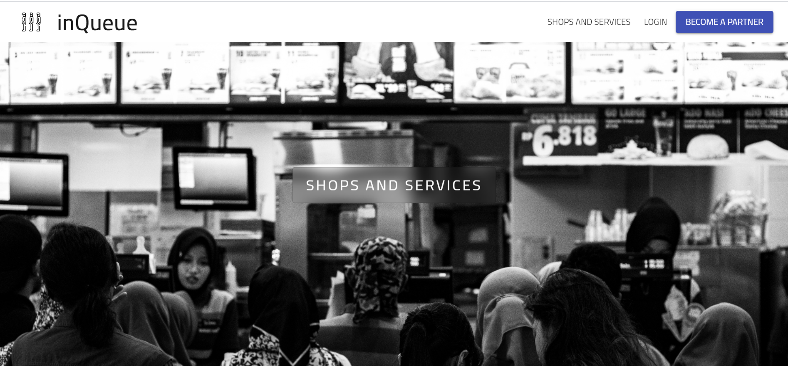

# USER DASHBOARD

### Login/SignIn (Existing Users)

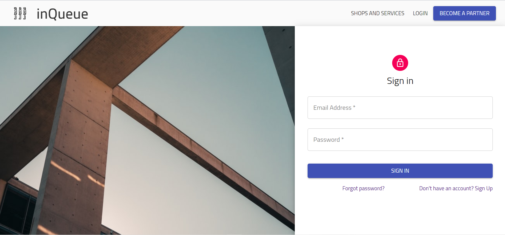

- Click on Login button on HomePage
- Enter Email and Password and then click SignIN button

### Signup

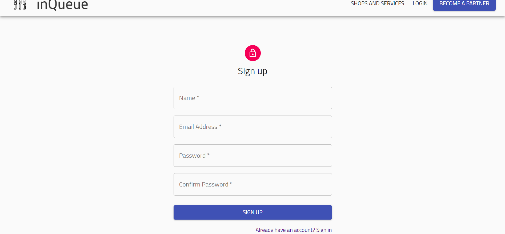

- Go to Login Page and click on Don't have an account? Sign Up
- Enter Name,Email,Password,Password Confirm
- Click on Signup button

### All Shops amd services

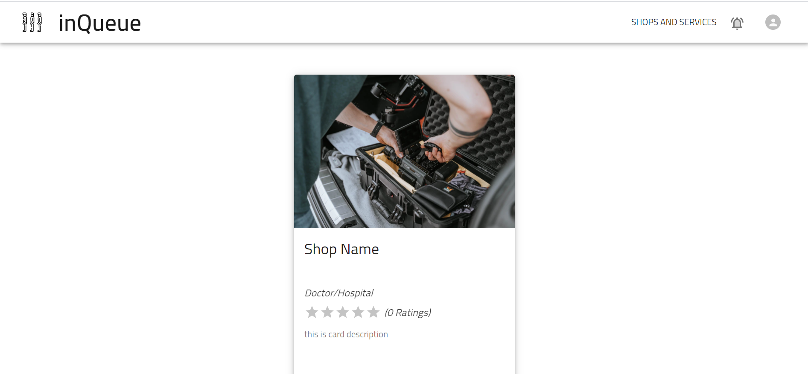

- To see all shops click on Shop And Services button on HomePage
- After that a page like shown above will be open where you can click on the shop for which you need a ticket

### Token Generation

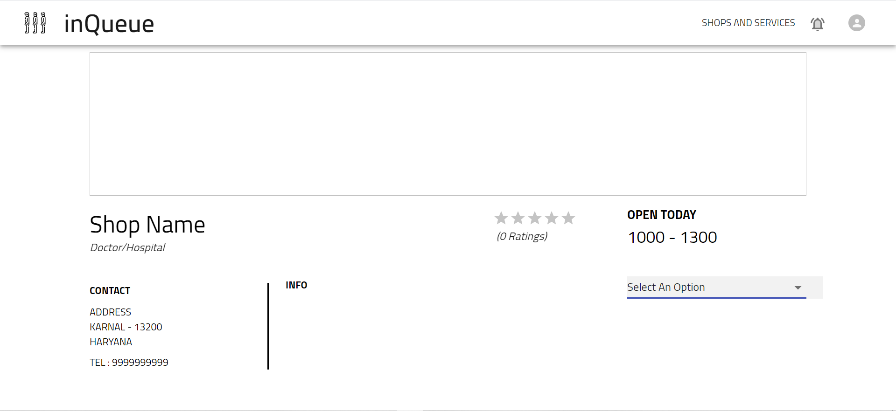
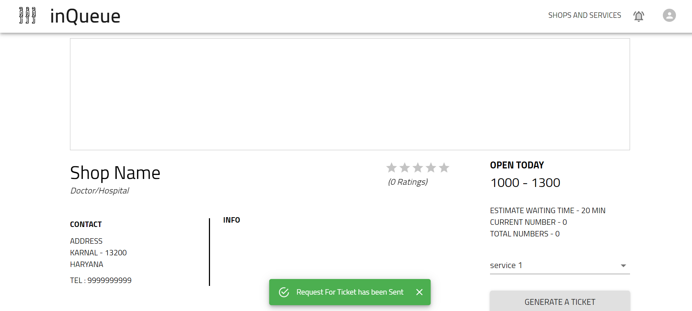

- To generate a token click on a shop for which you want to generate a token
- Select an option (There can be many services offered by a shop for Example if it is a hospital there can be different Queues for Different Labs or different doctors)
- After that click on Generate a token button
- A request for a token will be sent to the Shop Admin
- After the Response of the shop owner you will get a notification which you can see by click on bell icon on navbar

### Get Information about all Tickets

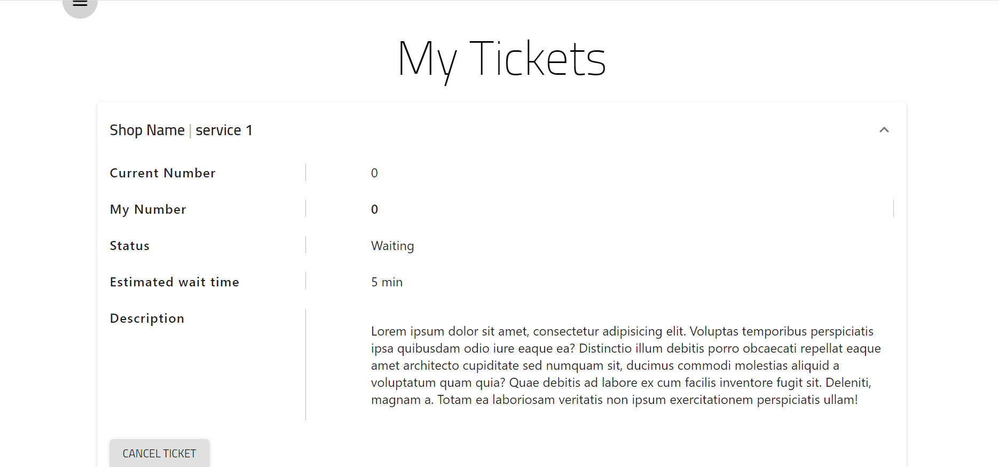

- To know status of all tokens click on avatar icon on navbar
- Here you will get all information about the token
- There can be three status of the token waiting,accepted or rejected
- user can cancel token by clicking on cancel button
- By clicking on Icon on top left corner A drawer will be open

### Other Settings

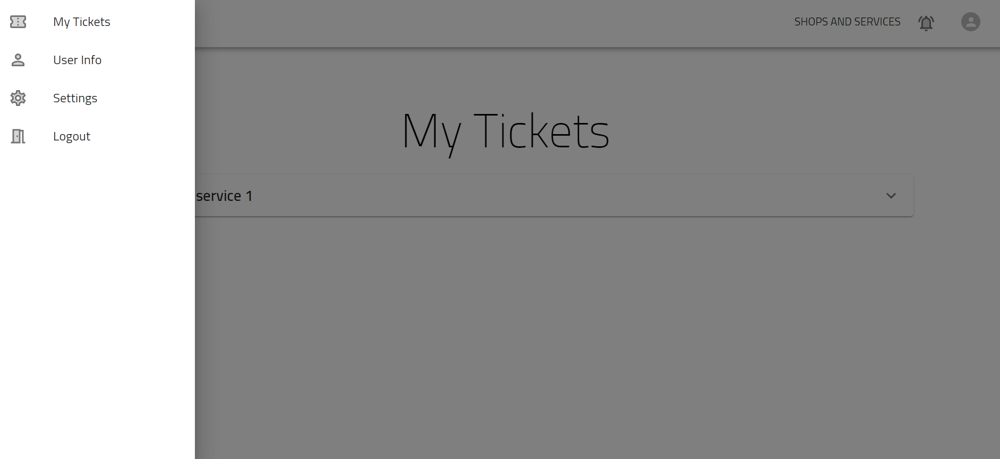

- By click on user info on Drawer user can change there name and profile Picture
- By clicking on Logout Button user can logout

# SHOP ADMIN DASHBOARD

### Login

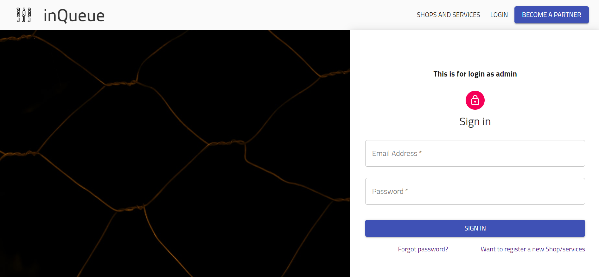

- Click on Become A Partner button on HomePage
- Enter Email and Password and then click on SignIN button

### New Account

- To create a new account click on Want to register a new Shop/services
- A new Shop Account will be created with default settings you can change settings by click on settings button on navbar

### Settings

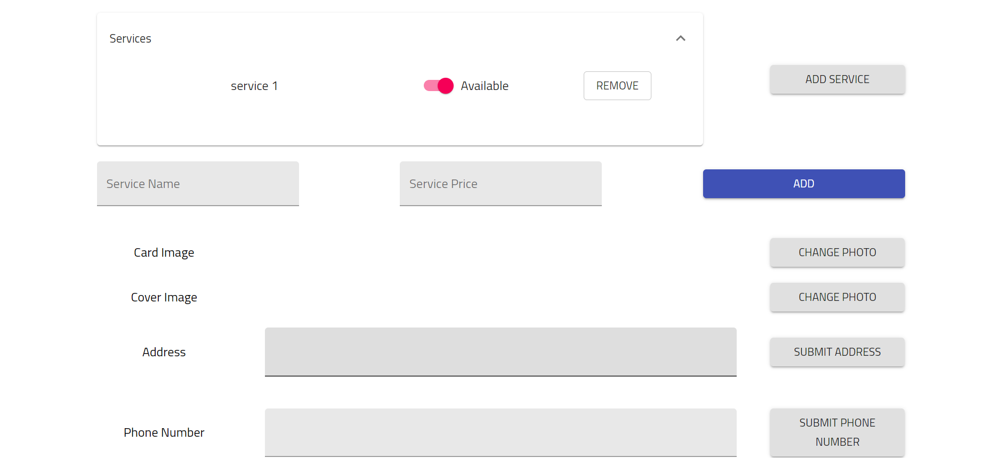

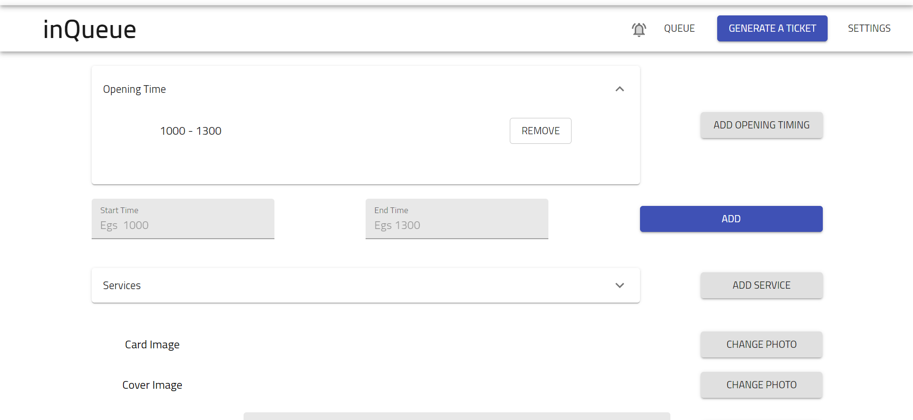

- You can change Shop settings by click on settings button on Navbar

### Queue

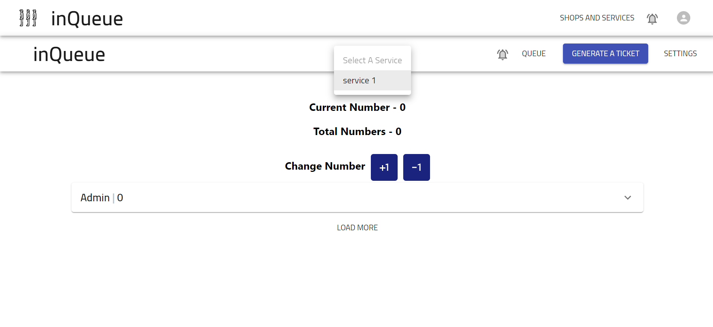

- By clicking Queue Button you can get/change Queue number
- Select a service of which you want to change info
- admin can see all customers info in this section

### Generate a Ticket

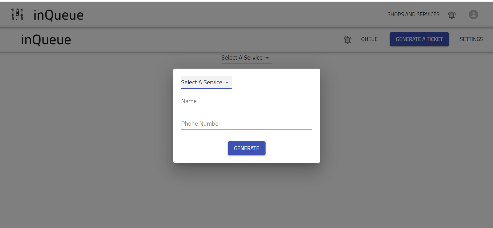

- shop admin can generate a ticket by clicking on generate a ticket button on navbar
